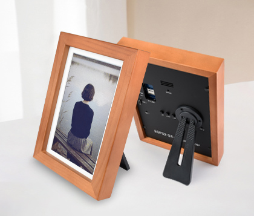
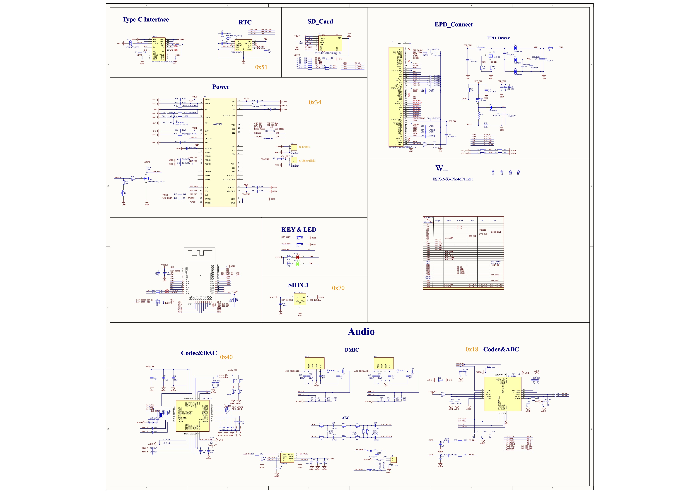

# Arduino - Waveshare ESP32-S3 PhotoPainter

> [!CAUTION]
> The information and material (code, files, ...) are provided "AS IS". We make no representation or warranty of any kind, express or implied, regarding the accuracy, adequacy, validity, reliability, availability, or completeness of any information or material. Use this at your own risk.

> [!CAUTION]
> This page was created based on the v1 hardware. This version has major power issues: https://github.com/waveshareteam/ESP32-S3-PhotoPainter/issues/5 
> Supposedly, v2 will have a different PMU. This page will be updated once I get my hands on the new version. 

## Document Goals

* Describe all important hardware features of the Waveshare ESP32-S3 PhotoPainter (microprocessor, display, sensors, etc.).
  * including the technical details needed to interface with them 
  * (datasheets, physical pinout, protocols, etc.)
* Demonstrate how to use all hardware features in custom Arduino-based firmware for the Waveshare ESP32-S3 PhotoPainter.
  * with working code examples using Arduino-ESP32

## Table of Contents

* [Introduction](#introduction)
* [Hardware Description & Code Examples](#hardware-description--code-examples)
    * [Pinout Summary](#pinout-summary)
    * [Microcontroller](#microcontroller)
    * [Buttons](#buttons)
    * [Power Management (AXP2101)](#power-management-axp2101)
    * [SD Card](#sd-card)
    * [Temperature & Humidity Sensor (SHTC3)](#temperature--humidity-sensor-shtc3)
    * [RTC (PCF85063ATL)](#rtc-pcf85063atl)
    * [ADC Audio Decoder (ES7210)](#adc-audio-decoder-ES7210)
    * [DAC Audio Encoder (ES8311)](#dac-audio-encoder-ES8311)
    * [PSRAM](#psram)
    * [Display](#display)
* [Development Environment](#development-environment)
    * [Backup Firmware](#backup-firmware)
    * [Option 1: Arduino IDE](#option-1-arduino-ide)
    * [Option 2: Arduino CLI](#option-2-arduino-cli)
    * [Option 3: PlatormIO](#option-3-platformio) 
* [Troubleshooting](#troubleshooting)
* [References](#references)

---

# Introduction

The Waveshare ESP32-S3 PhotoPainter 7.3inch is a digital picture frame with a Spectra E6 ePaper display, and ESP32-S3 microcontroller. It can be used as picture frame, but also calendar, dashboard, etc.

See the official product page for more info: https://www.waveshare.com/esp32-s3-photopainter.htm

The official ESP-IDF framework for programming the ESP32 family of microcontrollers is very powerful, but not the most user-friendly. For this reason many people prefer to use the Arduino framework (and it's many many ready-to-use libraries) for programming ESP32 hardware. 

 

(image source: official [Waveshare product page](https://www.waveshare.com/esp32-s3-photopainter.htm))

When I tried to write custom Arduino-based firmware for this device, I found that the hardware documentation was lacking. Small details are scattered across repositories and forum threads, but I could not find a complete overview. I also figured out some details not described anywhere else. This repository describes the hardware in detail, allowing you to make full use of all the hardware components in your custom firmware. Some code examples are also provided for Arduino-ESP32. 

---

# Hardware Description & Code Examples

Luckily for us, the hardware itself is well documented by the manufacturer:



(image source: official [Waveshare Wiki](https://www.waveshare.com/wiki/ESP32-S3-PhotoPainter#Schematic_Diagram))

The following information was verified on an ESP32-S3 PhotoPainter that I purchased from AliExpress mid-2025. The most notable hardware features are:

Important ICs:

* ESP32-S3-WROOM-1-N16R8 Microcontroller
    * Wi-Fi and Bluetooth SoC, 240MHz operating frequency, with integrated 16MB Flash and 8MB PSRAM.
    * The 8MB PSRAM is important, as image processing would be challenging using only the microcontroller's 512kb regular RAM. 
* PCF85063ATL RTC
* SHTC3 temperature and humidity sensor
* ES7210 ADC audio decoder chip
    * for processing audio input via the microphone
* ES8311 DAC audio encoder chip
    * for producing audio output through the speaker 
* AXP2101 power management IC

User Input/Output:

* 7.3inch E Ink Spectra 6 (E6) Color E-Paper Display (800×480)
* 3 pushbuttons (on the back)
* Dual-microphone array
* Speaker
* MicroSD card slot

See official product pages for more info:

* https://www.waveshare.com/esp32-s3-photopainter.htm
* https://www.waveshare.com/wiki/ESP32-S3-PhotoPainter

---

## Pinout Summary

| Hardware Component | GPIO | Info |
|---|---|---|
| PMU | I2C (SDA=`GPIO 47`, SCL=`GPIO 48`) | AXP2101, address `0x34` | 
| Temperature / Humidity Sensor | I2C (SDA=`GPIO 47`, SCL=`GPIO 48`) | SHTC3, address `0x70` | 
| RTC | I2C (SDA=`GPIO 47`, SCL=`GPIO 48`) | PCF85063, address `0x51` | 
| ADC Audio Decoder | I2S + I2C (SDA=`GPIO 47`, SCL=`GPIO 48`) | ES7210, address `0x40` | 
| DAC Audio Encoder | I2S + I2C (SDA=`GPIO 47`, SCL=`GPIO 48`) | ES8311, address `0x18` | 
| SD Card | SPI (D1=`GPIO 1`, D2=`GPIO 2`, CS=`GPIO 38`, CLK=`GPIO 39`, MISO=`GPIO 40`, MOSI=`GPIO 41`) |  | 
| ePaper Display | SPI (DC=`GPIO 8`, CS=`GPIO 9`, SCK=`GPIO 10`, DIN=`GPIO 11`, RST=`GPIO 12`, BUSY=`GPIO 13`) | Spectra 6 (E6) | 
| Button "Boot" 	 | GPIO 0  | Active low | 
| Button "Key" 	 | GPIO 4  | Active low | 

---

## Microcontroller

The microcontroller is a ESP32-S3-WROOM-1-N16R8. See datasheet for all details: https://documentation.espressif.com/esp32-s3-wroom-1_wroom-1u_datasheet_en.pdf

The version used in the PhotoPainter is the version with 8MB of PSRAM. 

I have not noticed any abnormal factory configuration or protection, so we can treat the microcontroller like any ESP32 S3 for hobby purposes. Any tutorials you find about using the ESP32 S3 also apply to this device. No special hardware is needed to flash firmware, it is flashable out of the box using USB. 

See the section "Development Environment" in this document for concrete instructions on how to flash custom firmware to the PhotoPainter.

---

## Buttons

There are three physical buttons on the back of the frame:

* PWR
    * hardwired to the microcontroller reset pin (EN)
    * cannot be used for user input
* BOOT
    * GPIO 0
    * hardwire to the microcontroller boot pin (GPIO 0)
    * used as boot button during startup
    * can be used for custom input AFTER startup
* KEY
    * GPIO 4
    * can be used for custom input

The buttons are "active low", meaning the signal is LOW when pressed, HIGH when unpressed.

It's a good idea to activate the internal pullup resistor, to avoid having the button pins in a floating state:

```C
    pinMode(0, INPUT_PULLUP);
    pinMode(4, INPUT_PULLUP);
```

The following is a  minimal example to illustrate how the hardware works. However, ideally a dedicated library is used to handle button input (including debouncing, interrupts, etc.). After flashing this example, check the serial monitor to see some output when pressing the buttons.

> [!NOTE] 
> Arduino Example for ESP32-S3 PhotoPainter
>
> ```C
> #define PIN_BTN_KEY     4
> #define PIN_BTN_BOOT    0
> 
> void setup() {
>     Serial.begin(115200);
>    
>     pinMode(PIN_BTN_KEY, INPUT_PULLUP);
>     pinMode(PIN_BTN_BOOT, INPUT_PULLUP);
> }
> 
> void loop() {
>     if(digitalRead(PIN_BTN_KEY) == LOW) {
>     	Serial.println("button: key");
>     }
>     
>     if(digitalRead(PIN_BTN_BOOT) == LOW) {
>     	Serial.println("button: boot");
>     }
> 
>     delay(100);
> }
> ```

---

## Power Management (AXP2101)

The AXP2101 manages everything power-related, including battery charging and converting voltages. Communication with this PMU is done via I2C (SDA=`GPIO47`, SCL=`GPIO48`), at address `0x34`.

One interesting feature of the AXP2101 is that it allows you to read battery voltage and estimated remaining battery capacity. 

The AXP2101 also has four LDO regulators, and two of them are used to power the audio and display circuitry. 

* LDO 1
    * unused
* LDO 2
    * unused
* LDO 3
    * powers everything audio-related (DAC, ADC, ...)
* LDO 4
    * powers everything related to the epaper display

Keep in mind that these LDOs are disabled by default, so you have to enable the relevant LDOs in your code to make use of audio or display-related hardware. 

Note that these LDOs can also be used as a power-saving mechanism; you can simply cut power to the audio or display by turning off these LDOs, to reduce their power consumption to 0. 

This PMU can generate interupts on `GPIO 21`, to notify the microcontroller of power-related events. 

> [!CAUTION]
> Be careful with the PMU settings. You can permanently damage the hardware, for instance by setting the wrong output voltage for the LDOs. 

The following example uses XPowersLib to use the AXP2101: https://github.com/lewisxhe/XPowersLib. In this example we enable voltage monitoring and LDO4 (power for ePaper circuitry). Don't forget to install the library via your development environment (Arduino IDE, Arduino CLI, PlatformIO, ...).

> [!NOTE] 
> Arduino Example for ESP32-S3 PhotoPainter
> 
> ```C
> 
> #include <XPowersLib.h>
> 
> #define I2C_SDA    47
> #define I2C_SCL    48
> 
> XPowersAXP2101 pmu;
> 
> void setup() {
>   Serial.begin(115200);
> 
>   // important! this device does not use the default I2C pins! 
>   Wire.begin(I2C_SDA, I2C_SCL);
>  
>   pmu.begin(Wire, AXP2101_SLAVE_ADDRESS, I2C_SDA, I2C_SCL);
>   pmu.enableSystemVoltageMeasure();
>   pmu.setALDO4Voltage(3300);
>   pmu.enableALDO4(); // enables power to the epaper circuitry
> 
>   delay(100);
> }
> 
> void loop() {
>   float vbat = pmu.getBattVoltage();
>   float vsys = pmu.getSystemVoltage();
>   float valdo4 = pmu.getALDO4Voltage();
>   if (vbat > 100.0f) vbat /= 1000.0f;
>   if (vsys > 100.0f) vsys /= 1000.0f;
>   if (valdo4 > 100.0f) valdo4 /= 1000.0f;
> 
>   Serial.printf("V_BAT=%.3f, V_SYS=%.3f, V_ALDO4=%.3f, CHARGING=%s \n", vbat, vsys, valdo4, pmu.isCharging() ? "yes" : "no");
> 
>   if (pmu.isBatteryConnect()) {
>     Serial.printf("Estimated Battery Percentage: %d%% \n", pmu.getBatteryPercent()); 
>   }
> 
>   delay(2000);
> }
> ```

See the library's official examples for more advanced use:
https://github.com/lewisxhe/XPowersLib/tree/master/examples

---

## SD Card

The SD card is accessible via SPI (CS=`GPIO38`, CLK=`GPIO39`, MISO=`GPIO40`, MOSI=`GPIO41`). Note that this is a different SPI channel than the one used for the display. 

The SD card can be read or written using the default Arduino SD library:
https://docs.arduino.cc/libraries/sd/

The hardware configuration for the PhotoPainter looks like this:

> [!NOTE] 
> Arduino Example for ESP32-S3 PhotoPainter
> 
> ```C
> #include <SPI.h>
> #include <SD.h>
> 
> #define PIN_SD_CS   38
> #define PIN_SD_CLK  39
> #define PIN_SD_MISO 40
> #define PIN_SD_MOSI 41
> 
> SPIClass spi_sd(HSPI);
> 
> void setup() {
>   Serial.begin(115200);
> 
>   spi_sd.begin(PIN_SD_CLK, PIN_SD_MISO, PIN_SD_MOSI, PIN_SD_CS);
>   SD.begin(PIN_SD_CS, spi_sd, 4000000);
> 
>   ...
> }
> ```

Using this configuration, any of the official SD examples on the library website can be used:
https://docs.arduino.cc/learn/programming/sd-guide/

---

## Temperature & Humidity Sensor (SHTC3)

The SHTC3 can measure temperature and humidity. These values are read digitally via I2C. 

Communication with this sensor is done via I2C (SDA=`GPIO47`, SCL=`GPIO48`), at address `0x70`.

Note that the temperature will often be a bit higher than the actual air temperature, as the other electronics in the frame will be producing some heat during operation.

The following example uses the Adafruit SHTC3 Library to read the sensor: https://github.com/sparkfun/SparkFun_SHTC3_Arduino_Library. Don't forget to install the library via your development environment (Arduino IDE, Arduino CLI, PlatformIO, ...). Note that there many other libraries for this sensor. 

> [!NOTE] 
> Arduino Example for ESP32-S3 PhotoPainter
> 
> ```C
> #include "Adafruit_SHTC3.h"
> 
> #define I2C_SDA    47
> #define I2C_SCL    48
> 
> Adafruit_SHTC3 shtc3 = Adafruit_SHTC3();
> sensors_event_t humidity, temp;
> 
> void setup() {
>   Serial.begin(115200);
> 
>   // important! this device does not use the default I2C pins! 
>   Wire.begin(I2C_SDA, I2C_SCL);
> 
>   shtc3.begin();
> }
> 
> void loop() {
>   shtc3.getEvent(&humidity, &temp);
>     
>   Serial.print("Temperature: "); 
>   Serial.print(temp.temperature); 
>   Serial.println(" degrees C");
> 
>   Serial.print("Humidity: "); 
>   Serial.print(humidity.relative_humidity); 
>   Serial.println("% rH");
> 
>   delay(1000);
> }
> ```
 
---
 
## RTC (PCF85063ATL)

Communication with this RTC is done via I2C (SDA=`GPIO47`, SCL=`GPIO48`), at address `0x51`. 

The RTC built into the ESP32 microcontroller is not very accurate, and is not meant to be used to track real-world time. For that, you should use the separate PCF85063 RTC included on the PCB. The RTC can also generate interupts (e.g. for waking the microcontroller from sleep, or triggering display updates) on `GPIO 6`.

There are plenty of libraries for Arduino for the PCF85063:
* https://github.com/lewisxhe/SensorLib
* https://github.com/SolderedElectronics/PCF85063A-Arduino-Library
* https://github.com/teddokano/RTC_NXP_Arduino
* ...

The following example uses SensorLib to use the RTC: https://github.com/lewisxhe/SensorLib. Don't forget to install the library via your development environment (Arduino IDE, Arduino CLI, PlatformIO, ...).

> [!NOTE] 
> Arduino Example for ESP32-S3 PhotoPainter
> 
> ```C
> #include <SensorPCF85063.hpp>
> 
> #define I2C_SDA    47
> #define I2C_SCL    48
> #define RTC_IRQ    6
> 
> SensorPCF85063 rtc;
> 
> RTC_DateTime datetime;
> struct tm timeinfo;
> char buf[64];
> 
> void setup() {
>   Serial.begin(115200);
> 
>   // important! this device does not use the default I2C pins! 
>   Wire.begin(I2C_SDA, I2C_SCL);
>  
>   rtc.begin(Wire, I2C_SDA, I2C_SCL);
> 
>   set_time();
> }
> 
> void loop() {
>   datetime = rtc.getDateTime();
>   timeinfo = datetime.toUnixTime();
> 
>   strftime(buf, 64, "%A, %B %d %Y %H:%M:%S", &timeinfo);
>   Serial.println(buf);
> 	
>   delay(1000);
> }
> 	
> // extract the compilation time of the current firmware, and set that as current time in the RTC	
> void set_time()
> {
>     char s_month[5];
>     int year;
>     tm t{};
>     static constexpr char month_names[37] = "JanFebMarAprMayJunJulAugSepOctNovDec";
> 	
>     // extract time values from compilation timestamp embedded in firmware
>     sscanf(__DATE__, "%s %d %d", s_month, &t.tm_mday, &year);
>     sscanf(__TIME__, "%2d %*c %2d %*c %2d", &t.tm_hour, &t.tm_min, &t.tm_sec);
> 	
>     // find where s_month is in month_names, deduce month value.
>     t.tm_mon = (strstr(month_names, s_month) - month_names) / 3;
>     t.tm_year = year - 1900;
> 	
>     // optional: add 30 seconds to compensate for compile/upload time
>     time_t timestamp = mktime(&t);
>     timestamp = timestamp + 30;
>     localtime_r(&timestamp, &t);
> 	
>     // Set the defined date and time on the RTC
>     rtc.setDateTime(t);
> }
> ```

See the library's official examples for more advanced usage:
* https://github.com/lewisxhe/SensorLib/blob/master/examples/PCF85063_SimpleTime/PCF85063_SimpleTime.ino
* https://github.com/lewisxhe/SensorLib/blob/master/examples/PCF85063_ClockOutput/PCF85063_ClockOutput.ino
* https://github.com/lewisxhe/SensorLib/blob/master/examples/PCF85063_AlarmByUnits/PCF85063_AlarmByUnits.ino

Use Google to find examples on how to obtain the current time via WiFi, before setting it in the RTC, e.g.: https://randomnerdtutorials.com/esp32-date-time-ntp-client-server-arduino/

---

## ADC Audio Decoder (ES7210)

Communication with this ADC is done via I2S and I2C (SDA=`GPIO47`, SCL=`GPIO48`), at address `0x40`.

TODO

---

## DAC Audio Encoder (ES8311)

https://github.com/pschatzmann/arduino-audio-driver/blob/main/examples/audiotools/audiotools-standard/audiotools-standard.ino

Communication with this DAC is done via I2S and I2C (SDA=`GPIO47`, SCL=`GPIO48`), at address `0x18`.

TODO

---

## PSRAM

Next to 512kb "regular" RAM, the ESP32-S3-WROOM-1-N16R8 also has 8MB of external PSRAM. This is important for the PhotoPainter's use case, as the regular RAM would not be able to contain all pixel data for the display. The generous 8MB of extra PSRAM gives us the space to work with images (manipulation, conversion, ...) and to keep the entire display framebuffer in memory while doing so. 

PSRAM support is provided by the Arduino implementation for ESP32-S3. To use, simply call `psramInit()` and then you can use `ps_malloc()` and `free()`, similar to regular memory allocation. 

> [!TIP]
> Recent versions the ESP32 Arduino implementation will automatically use PSRAM for larger memory allocations. In that case the code below might not even be needed. 

> [!NOTE] 
> Arduino Example for ESP32-S3 PhotoPainter
> 
> ```C
> byte* img_buffer;
> 
> void setup() {
>   Serial.begin(115200);
> 
>   psramInit();
>  
>   Serial.printf("Total PSRAM: %d \n", ESP.getPsramSize());
>   Serial.printf("Free PSRAM: %d \n", ESP.getFreePsram());
> 
>   // allocate 1MB in PSRAM (note: this wouldn't fit in regular RAM)
>   img_buffer = (byte*)ps_malloc(1024 * 1024);
> 
>   Serial.printf("Free PSRAM after ps_malloc: %d \n", ESP.getFreePsram());
> 
>   // clean up
>   free(img_buffer);
> 
>   Serial.printf("Free PSRAM after cleanup: %d \n", ESP.getFreePsram());
> }
> 
> void loop() {
>   delay(2000);
> }
> ```

---

## Display

The ePaper display is a 7.3inch E Ink Spectra 6 (E6) Color E-Paper Display (800×480).

For more info see here:
* https://www.good-display.com/blank7.html?productId=533

The excellent [GxEPD2](https://github.com/ZinggJM/GxEPD2) library has recently added support for the display. The library refers to it via the panel product code "GDEP073E01". 

The following example uses GxEPD2: https://github.com/ZinggJM/GxEPD2. Don't forget to install the library via your development environment (Arduino IDE, Arduino CLI, PlatformIO, ...).

> [!NOTE] 
> Arduino Example for ESP32-S3 PhotoPainter
> 
> ```C
> #include <GxEPD2_7C.h>
> #include <Fonts/FreeMonoBold9pt7b.h>
> 
> #include <Wire.h>
> #include <SPI.h>
> 
> // EPD SPI
> #define PIN_DC     8
> #define PIN_CS     9
> #define PIN_SCK    10
> #define PIN_MOSI   11
> #define PIN_MISO   -1
> #define PIN_RST    12
> #define PIN_BUSY   13
> 
> GxEPD2_7C<GxEPD2_730c_GDEP073E01, GxEPD2_730c_GDEP073E01::HEIGHT> display(
>   GxEPD2_730c_GDEP073E01(PIN_CS, PIN_DC, PIN_RST, PIN_BUSY)
> );
> 
> const char HelloWorld[] = "Hello World!";
> 
> void setup() {
>     Serial.begin(115200);
> 
>     SPI.begin(PIN_SCK, PIN_MISO, PIN_MOSI, PIN_CS);
> 
>     display.init(115200, true, 2, false);
> 
>     display.setRotation(1);
>     display.fillScreen(GxEPD_WHITE);
> 
>     display.setFont(&FreeMonoBold9pt7b);
>     display.setTextColor(GxEPD_BLACK);
>     display.setCursor(10, 10);
>     display.print(HelloWorld);
> 
>     display.display();
> 
>     display.hibernate();
> }
> 
> void loop() {
>   delay(1000);
> }
> ```

One issue with the example above, is that the GxEPD2 object will allocate a huge framebuffer in the background. 
For the PhotoPainter display this takes up to 80% of available RAM, which is problematic if you also need WiFi and other RAM-demanding features. 

The official GxEPD2 approach is to divide the display into "pages", and use paged drawing:

```C
// NOTE THE GxEPD2_730c_GDEP073E01::HEIGHT / 4 !!! 
// this divides the display in 4 pages, so the framebuffer only takes 1/4th of the memory
GxEPD2_7C<GxEPD2_730c_GDEP073E01, GxEPD2_730c_GDEP073E01::HEIGHT / 4> display(
  GxEPD2_730c_GDEP073E01(PIN_CS, PIN_DC, PIN_RST, PIN_BUSY)
);

display.setFullWindow();
display.firstPage();
do
{
    // draw stuff using regular Adafruit GFX interface
    display.fillScreen(GxEPD_WHITE);
}
while (display.nextPage());
```

However, paged drawing on the Spectra E6 does not seem to be well supported, and the display seems to go through a full 10-second refresh cycle for every page (takes 30+ seconds of flickering to refresh the entire screen).

A better approach is to make sure GxEPD2 allocates a full framebuffer, but in PSRAM instead of regular RAM.
There is no easy way to allocate the framebuffer ourselves, but we can make GxEPD2 allocate the framebuffer in PSRAM by using `heap_caps_malloc_extmem_enable()`.
This instruction tells the system to automatically allocate memory in PSRAM (instead of regular RAM), for large MALLOC/CALLOC calls above a certain threshold.

```C
GxEPD2_7C<GxEPD2_730c_GDEP073E01, GxEPD2_730c_GDEP073E01::HEIGHT>* display;
heap_caps_malloc_extmem_enable(10*1024); // everything larger than 10kb should be allocated in PSRAM instead of regular RAM
display = new GxEPD2_7C<GxEPD2_730c_GDEP073E01, GxEPD2_730c_GDEP073E01::HEIGHT>(GxEPD2_730c_GDEP073E01(PIN_CS, PIN_DC, PIN_RST, PIN_BUSY));

display->fillScreen(GxEPD_WHITE);
display->display();
```

Note that `heap_caps_malloc_extmem_enable()` affects ALL memory allocations above the provided threshold (not just the ones made by GxEPD2). 
However, that's not always a bad thing per se, if you're not optimising for performance. 


GxEPD2 uses Adafruit_GFX internally (and exposes the same interface), so see both the GxEPD2 and Adafruit_GFX pages for more examples:
* https://github.com/ZinggJM/GxEPD2
* https://github.com/adafruit/Adafruit-gfx-library

---

# Development Environment

In terms of development environment, the setup procedure is the same as any ESP32-based board. 

There are different ways to work with Arduino for the ESP32-S3:
* Option 1: Arduino IDE
* Option 2: Arduino CLI
* Option 3: PlatformIO

## Backup Firmware

Before messing with the firmware, you might want to make a backup of the factory firmware. This is done using the regular ESP32 tools (esptool.py). See:

[https://cyberblogspot.com/how-to-save-and-restore-esp8266-and-esp32-firmware/](https://cyberblogspot.com/how-to-save-and-restore-esp8266-and-esp32-firmware/)

In summary, check how big the flash is:

```bash
esptool.py flash_id
```

esptool confirms that we have 8MB of flash memory to backup:

```bash
esptool.py v4.8.1
Found 1 serial ports
Serial port /dev/cu.usbmodem1444301
Connecting...
Detecting chip type... ESP32-S3
Chip is ESP32-S3 (QFN56) (revision v0.2)
Features: WiFi, BLE, Embedded PSRAM 8MB (AP_3v3)
Crystal is 40MHz
MAC: d0:cf:13:01:c9:00
Uploading stub...
Running stub...
Stub running...
Manufacturer: 46
Device: 4018
Detected flash size: 16MB
Flash type set in eFuse: quad (4 data lines)
Flash voltage set by eFuse to 3.3V
Hard resetting via RTS pin...
```

We use the port and flash size from the output above, and use those values to perform the backup like this:

```
esptool.py --baud 230400 --port /dev/cu.usbmodem1444301 read_flash 0 16777216 photopainter-backup-16M.bin
```

## Option 1: Arduino IDE

To set up a development environment in Arduino IDE for the ESP32 family of microcontrollers, see for instance:

[https://samueladesola.medium.com/how-to-set-up-esp32-wroom-32-b2100060470c](https://samueladesola.medium.com/how-to-set-up-esp32-wroom-32-b2100060470c)

In summary:

* Add the additional board manager URL for the ESP32 products in the preference window:
	* https://dl.espressif.com/dl/package_esp32_index.json
* Download "ESP32 by espressif" in the board manager
* Select "ESP32S3 Dev Module" as the target board
* Set the following settings in the "Tools" menu:
    * Flash size: 16MB
    * PSRAM: OPI PSRAM
    * USB CDC On Boot: Enabled
    * Partition Scheme: Default

To test your configuration, upload the following sketch:

```C
void setup() {
    Serial.begin(9600);
}

void loop() {
    Serial.println("Hello World!");
    delay(1000);
}
```

This should compile and upload without errors, and when you open the Serial Monitor you should see "Hello World" appear every second. 

## Option 2: Arduino CLI

To set up a development environment with Arduino CLI, first install Arduino CLI:

```bash
https://arduino.github.io/arduino-cli/latest/installation
```

Then install Arduino Core for ESP32 (official package by Espressif):

```bash
arduino-cli core update-index --additional-urls https://dl.espressif.com/dl/package_esp32_index.json
arduino-cli core search esp32:esp32 --additional-urls https://dl.espressif.com/dl/package_esp32_index.json
arduino-cli core install esp32:esp32  --additional-urls https://dl.espressif.com/dl/package_esp32_index.json
```

None of the following libraries are strictly necessary for the Waveshare PhotoPainter, but if you want to run the examples in this document, you will also need to install these libraries:

```bash
arduino-cli lib install "Adafruit SHTC3 Library"
arduino-cli lib install "SensorLib"
arduino-cli lib install "XPowersLib"
arduino-cli lib install "GxEPD2"
```

To build your firmware:

```bash
arduino-cli compile --fqbn esp32:esp32:esp32s3:CDCOnBoot=cdc --verbose buttons.ino
```

Upload to ESP32:

```bash
arduino-cli board list
arduino-cli upload --fqbn esp32:esp32:esp32s3:CDCOnBoot=cdc --port /dev/cu.usbmodem1444301 --verbose
```

Monitor Serial output:

```bash
arduino-cli monitor --fqbn esp32:esp32:esp32s3 --port /dev/cu.usbmodem1444301 --discovery-timeout 2m
```
 
## Option 3: PlatformIO

To set up a development environment with PlatformIO, see:

[https://docs.platformio.org/en/latest/core/installation/index.html](https://docs.platformio.org/en/latest/core/installation/index.html)

PlatformIO config `examples/platformio.ini` is an example PlatformIO config file for the Waveshare ESP32-S3 PhotoPainter. 

At the time of writing PlatformIO does not have a board definition that matches the exact ESP32-S3 setup in the PhotoPainter. However, the `esp32-s3-devkitm-1` is close enough, so I used that as foundation, and override some of the settings in the ini file. Note that we are limited to 8MB flash (even though the device has 16MB), because PlatformIO does not include the needed files for 16M support for ESP32-S3 yet (e.g. partition maps). 

Using the `examples/platformio.ini`, you can use the typical PlatformIO commands:

* Clean: `pio run -t clean`
* Build: `pio run`
* Upload: `pio run -t upload`
* Serial Monitor: `pio device monitor`

Note: unlike with the arduino-cli method, it will not automatically install transitive dependencies (dependencies of dependencies) for you. You are responsible for adding these to the list yourself. To determine what you need, you can check the library manifest or make an educated guess based on the compilation errors. An even easier way is to use `arduino-cli` to get an overview of dependencies for a specific Arduino library. For instance, run `arduino-cli lib deps GxEPD2` to see the dependencies that GxEPD2 has. 

Note2: in the example `platformio.ini` I have pinned the versions of the libraries and their dependencies, to ensure a working example. However, you might want to use more recent versions if any are available in the future. 

---

# Troubleshooting

### The device is stuck in a reboot loop, or in deep sleep, and I can't flash new firmware

Put it in "upload mode" by:

* Unplug battery and usb, hold "boot" button while plugging in USB, keep holding for about 5 seconds. The device is now waiting for a firmware upload.

OR

* Press and hold the PWR button for 5 seconds, then hold down the BOOT button and click the PWR button to enter upload mode.

### The display is very dark, white areas look grey, colours look faded and/or there is ghosting

Make sure you enable LDO4 in the PMIC. Without this, the display will still work, but it will not receive enough power for a "proper" display refresh. 

See the section on [power management](#power-management-axp2101).

# References

Relevant Documentation:

* https://www.waveshare.com/esp32-s3-photopainter.htm
* https://www.waveshare.com/wiki/ESP32-S3-PhotoPainter

Relevant Code Examples:

* https://github.com/waveshareteam/PhotoPainter
* https://github.com/will-rigby/PhotoPainter-Nginx-Home-Assistant-Device
* https://github.com/ibisette/Ibis_Dash_Esp32s3_PhotoPainter
* https://github.com/aitjcize/esp32-photoframe
* https://github.com/multiverse2011/esp32-s3-photopainter
* https://github.com/shi-314/esp32-spectra-e6
* https://github.com/Duocervisia/e-paper-esp32-frame

Datasheets:

* https://files.waveshare.com/wiki/common/SHTC3_Datasheet.pdf
* https://files.waveshare.com/wiki/common/ES7210_DS.pdf
* https://files.waveshare.com/wiki/common/ES8311.user.Guide.pdf
* https://files.waveshare.com/wiki/common/ES8311.DS.pdf
* https://files.waveshare.com/wiki/common/Pcf85063atl1118-NdPQpTGE-loeW7GbZ7.pdf
* https://files.waveshare.com/wiki/7.3inch-e-Paper-HAT-(E)/7.3inch-e-Paper-(E)-user-manual.pdf

